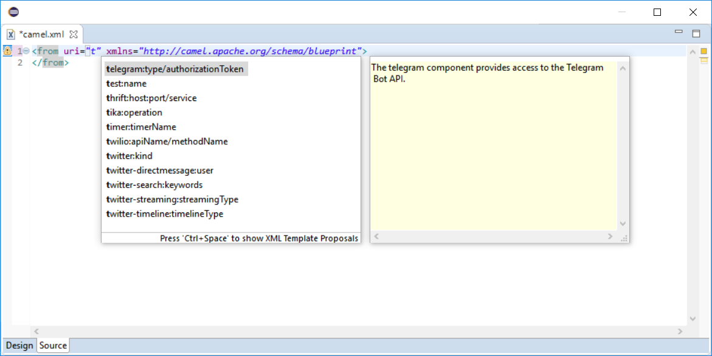
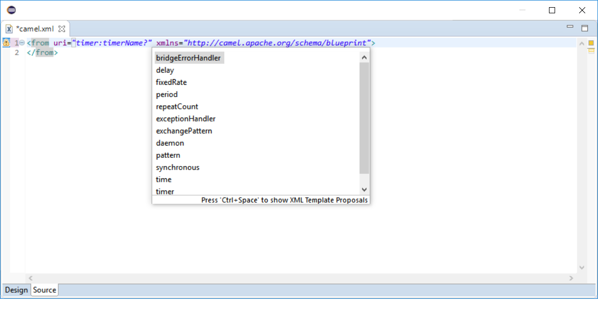
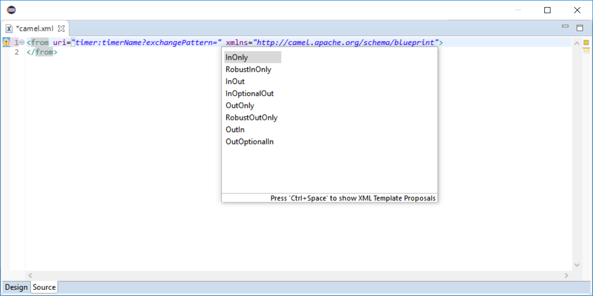
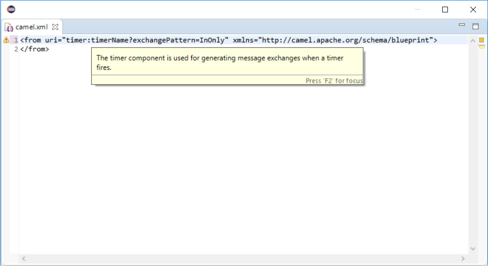
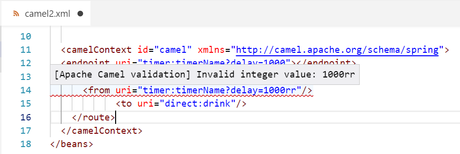
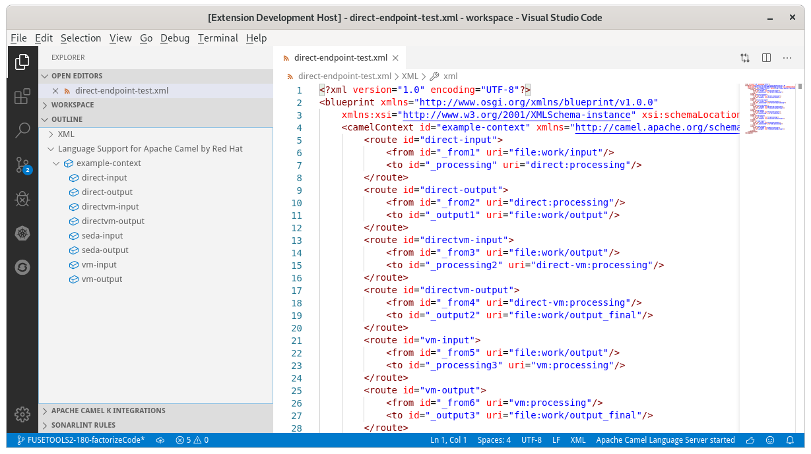
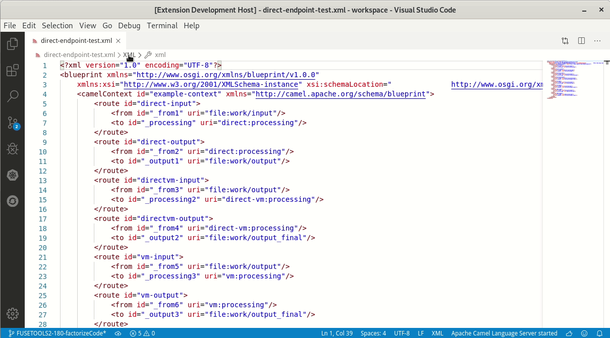

[]()
[]()
[](https://travis-ci.org/camel-tooling/camel-language-server)
[](https://sonarcloud.io/dashboard?id=camel-lsp-server)
[]()
[](https://gitter.im/camel-tooling/Lobby)

# camel-language-server

camel-language-server is a server implementation that provides Camel DSL smartness.
The server adheres to the [language server protocol](https://github.com/Microsoft/language-server-protocol)
and can be used with any editor that supports the protocol. The server utilizes [Apache Camel](https://camel.apache.org/).

# Clients

These clients are available:
* [Eclipse IDE](https://github.com/camel-tooling/camel-lsp-client-eclipse)
* [VS Code](https://github.com/camel-tooling/camel-lsp-client-vscode)
* [Eclipse Che](https://github.com/eclipse/che/pull/8648)
* [Atom Editor](https://github.com/camel-tooling/camel-lsp-client-atom)

Manual configuration is possible with:
* [Sublime Text](https://github.com/camel-tooling/camel-lsp-client-sublime)
* [CodeMirror](https://github.com/camel-tooling/camel-lsp-client-codemirror)

Help is welcome to provide more client implementations, especially for:
* [Emacs](https://github.com/camel-tooling/camel-lsp-client-emacs)
* [Eclipse Theia](https://github.com/camel-tooling/camel-lsp-client-theia)

## Features

### Code completion for Camel URI with XML DSL
* Completion for Camel components 
* Completion for Camel attributes 
* Completion for Camel attributes value 

### Hover on Camel URI with XML DSL

On hover, the documentation of the Camel component is available.


### Diagnostics (a.k.a. Validation) on Camel URI with XML DSL

On save, diagnostics on Camel URIs are updated:


### WebSocket support

Connection through WebSocket is supported. The server needs to be launched with `--websocket` option.

The following extra parameters can be used:
* `--port=<port>`, default value is `8025`
* `--hostname=<hostname>`, default value `localhost`
* `--contextPath=<contextPath>`, default value `/`. It must start with a `/`.

Then, the connection can be made through
`ws://<hostname>:<port><contextPath>/camel-language-server`.

For information, with all defaults, it is `ws://localhost:8025/camel-language-server`.

## Specific version of Camel catalog

It is possible to specify a specific version of the Camel catalog. This can be provided as Initialization Option or Workspace Configuration. The format is the same for both:

```
{
	"camel": {
		"Camel catalog version" : ...
	}
}
```

To use Red Hat Integration productized version, the Red Hat Maven GA repository needs to be configured on the host running the Camel Language Server. To configure it, follow these steps:
* Copy the [default grape config file corresponding to the version used by Camel](https://github.com/apache/groovy/blob/GROOVY_2_5_8/src/resources/groovy/grape/defaultGrapeConfig.xml) into _~/.groovy_ folder and call it _grapeConfig.xml_
* Add `<ibiblio name="fuse" m2compatible="true" root="https://maven.repository.redhat.com/ga/"/>` inside the chain node

For more information, check the [Grape official documentation](http://docs.groovy-lang.org/latest/html/documentation/grape.html#Grape-CustomizeIvysettings).

## Additional Camel components

It is possible to specify a list of additional Camel components. This can be provided as Initialization Option or Workspace Configuration. The format is the same for both:

```
{
	"camel": {
		"extra-components" : [
			...
		]
	}
}

```

## Document symbol support

There is document symbol for Camel Contexts and routes, on XML and Java DSL. In UI, for instance with VS Code, it means there are an outline, a breadcrumb and a Go To Document Symbol command.





## Features planned

* As you type reporting of parsing and compilation errors
* More advanced Code completion
* Code outline
* Code navigation
* Code lens (references)
* Highlights
* Code formatting

## Feedback

* File a bug in [GitHub Issues](https://github.com/camel-tooling/camel-language-server/issues).

## License

ASL 2.0, See [LICENSE](LICENSE) file.

